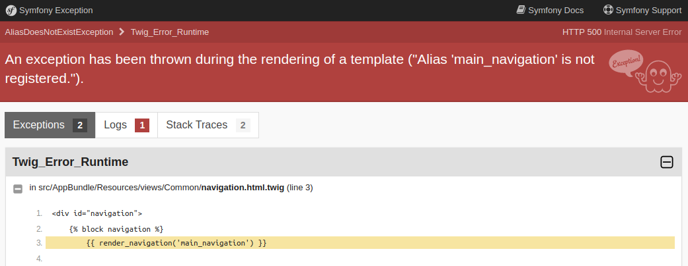

# Navigation Bundle

[](https://scrutinizer-ci.com/g/everlutionsk/navigation-bundle/?branch=master)
[](https://scrutinizer-ci.com/g/everlutionsk/navigation-bundle/build-status/master)

EverlutionNavigationBundle is Symfony Bundle for rendering multiple navigation instances registered dynamically by tagged services.

If you are looking just for Navigation library check out 
[everlutionsk/navigation](https://github.com/everlutionsk/navigation)

### Contents

- [Installation](#installation)
  - [Download the bundle](#download-the-bundle)
  - [Enable the bundle](#enable-the-bundle)
- [Configuration](#configuration)
- [Usage](#usage)
  - [Create navigation items](#create-navigation-items)
  - [Create container and register items](#create-container-and-register-items)
  - [Rendering the navigation](#rendering-the-navigation)
  - [Adding route with parameters to navigation item](#adding-route-with-parameters-to-navigation-item)
  - [Adding dynamic parameters to item route](#adding-dynamic-parameters-to-item-route)
  - [Highlight the current item in navigation](#highlight-the-current-item-in-navigation)
  - [Filtering the navigation items](#filtering-the-navigation-items)
  - [Adding nested items](#adding-nested-items)
  - [Rendering breadcrumbs](#rendering-breadcrumbs)
  - [Translating the item labels](#translating-the-item-labels)
- [Troubleshooting](#troubleshooting)
- [TO DO's](#to-dos)

## Installation

### Download the bundle

```console
$ composer require everlutionsk/navigation-bundle:^2
```

### Enable the bundle

```php
<?php
// app/AppKernel.php

// ...
class AppKernel extends Kernel
{
    public function registerBundles()
    {
        $bundles = array(
            // ...

            new Everlution\NavigationBundle\EverlutionNavigationBundle(),
        );

        // ...
    }

    // ...
}
```

## Configuration

You can specify custom router service. Router service must implement `Symfony\Component\Routing\RouterInterface`.

```yaml
everlution_navigation:
    router_service: router.default # this is the default value 
```

## Usage

### Create navigation items

You can create navigation item simply by implementing `Everlution\Navigation\Item\ItemInterface`.
Interface contains `getLabel(): string` method for providing label which will be shown and translated in template
and `isHidden(): bool` method. We have provided 3 traits so you can by default show
(`Everlution\Navigation\Item\ShownItemTrait`) or hide (`Everlution\Navigation\Item\HiddenItemTrait`) the item.
The third trait (`Everlution\Navigation\Item\TogglableTrait`) can be used
with `Everlution\Navigation\Item\TogglableInterface` which provides show/hide interface.

There are several other interfaces provided within namespace `Everlution\Navigation\Item`. By implementing these 
interfaces you add behaviours to the navigation items.

Please inspect interfaces within this namespace. We will describe some of them further in following sections.

Example:

```php
<?php

class SampleItem implements Everlution\Navigation\Item\ItemInterface
{
    use Everlution\Navigation\Item\ShownItemTrait;
    
    public function getLabel(): \Everlution\Navigation\Item\ItemLabelInterface
    {
        return new \Everlution\Navigation\Item\ItemLabel('navigation.sample.label');
    }
}
```

### Create container and register items

The simplest way to implement navigation items container is to extend `Everlution\Navigation\MutableContainer`
which provides predefined methods used internally within the bundle you need just to add the navigation items 
to the container.

Example:

```php
<?php

class SampleNavigation extends Everlution\Navigation\MutableContainer
{
    public function __construct()
    {
        array_map(
            [$this, 'add'],
            [
                new \SampleItem(),
                // you can specify multiple items here
            ]
        );
    }
}
```

By registering and tagging your navigation within service container the navigation will be automatically added to
navigation registry.

```yaml
# services.yml
services:
    \SampleNavigation:
        tags:
            - {name: 'everlution.navigation', alias: 'sample_navigation'}
```

As you can see we tagged the service with `everlution.navigation` name and we also provided an alias which will help
us reference the navigation in templates later.

### Rendering the navigation

Once you have the navigation registered within navigation registry you can call `render_navigation()` function in Twig
templates. The first argument is either navigation alias which you have set whilst defining the service eg. `sample_navigation`
or fully quantified class name of the navigation eg. `\SampleNavigation`.

Example:

```twig
{{ render_navigation('sample_navigation') }}
```

We have provided default template which will render navigation with [Bootstrap 4 styling](https://getbootstrap.com/docs/4.0/components/navs/#tabs)
you can examine the markup at `@EverlutionNavigation/bootstrap_navigation.html.twig`. If you need to change the markup 
you can provide path to your custom template as second argument eg. `render_navigation('sample_navigation', '@Path/To/custom_template.html.twig')`.

### Adding route with parameters to navigation item

Rendering the navigation without generating actual URLs would be useless. For simple usage with Symfony's Router
you only need to implement `Everlution\NavigationBundle\Bridge\Item\RoutableInterface` and provide route name 
and route parameters.
Most of the time you don't need any route parameters so you can use `Everlution\NavigationBundle\Bridge\Item\EmptyRouteParametersTrait`.

Example:

```php
<?php

class ItemWithRoute implements Everlution\Navigation\Item\ItemInterface, Everlution\NavigationBundle\Bridge\Item\RoutableInterface
{
    use Everlution\Navigation\Item\ShownItemTrait;
    
    public function getLabel(): \Everlution\Navigation\Item\ItemLabelInterface
    {
        return new \Everlution\Navigation\Item\ItemLabel('navigation.item_with_route.label');
    }
    
    public function getRoute(): string
    {
        return 'sample_route';
    }

    public function getParameters(): array
    {
        // if route does not expect any parameters just provide empty array
        // or use Everlution\NavigationBundle\Bridge\Item\EmptyRouteParametersTrait
        return [];
    }
}
```

The bundle will generate URL for you automatically at the rendering time of the navigation.

### Adding dynamic parameters to item route

There are times when you want to generate the same navigation for instance for multiple users and you just want
to be able to change few parameters for the route. Since the navigation items are just plain PHP objects you can
inject via constructor anything you wish, create the service within the service container and register the item
with navigation within the service container.

Example:

```php
<?php

class EditUserItem implements Everlution\Navigation\Item\ItemInterface, Everlution\NavigationBundle\Bridge\Item\RoutableInterface
{
    use Everlution\Navigation\Item\ShownItemTrait;

    /** @var UserIdProvider */
    private $idProvider;

    public function __construct(UserIdProvider $idProvider)
    {
        $this->idProvider = $idProvider;
    }
    
    public function getLabel(): \Everlution\Navigation\Item\ItemLabelInterface
    {
        return new \Everlution\Navigation\Item\ItemLabel('navigation.edit_user.label');
    }
    
    public function getRoute(): string
    {
        return 'edit_user_route';
    }

    public function getParameters(): array
    {
        return [
            'id' => $this->idProvider->getId(),
        ];
    }
}
```

Now register the navigation item with our `SampleNavigation`:

```yaml
# services.yml

services:
    # register EditUserItem
    \UserIdProvider: ~
    \EditUserItem:
        arguments:
            - '@\UserIdProvider'

    # add EditUserItem to SampleNavigation
    \SampleNavigation:
        calls:
            - ['add', ['@\EditUserItem']]
        tags:
            - {name: 'everlution.navigation', alias: 'sample_navigation'}
```

Sometimes when you just want to reuse some parameters from the current request. For that scenario we have prepared
`Everlution\NavigationBundle\Bridge\Item\RequestAttributesTrait`. It automatically injects 
`Everlution\NavigationBundle\Bridge\Item\RequestAttributesContainer` via constructor which can fetch attributes from
current master request.

Example:

```php
<?php

class ItemUsingRequestAttributes implements Everlution\Navigation\Item\ItemInterface, Everlution\NavigationBundle\Bridge\Item\RoutableInterface
{
    use Everlution\Navigation\Item\ShownItemTrait, Everlution\NavigationBundle\Bridge\Item\RequestAttributesTrait;
    
    public function getLabel(): \Everlution\Navigation\Item\ItemLabelInterface
    {
        return new \Everlution\Navigation\Item\ItemLabel('navigation.request_attributes.label');
    }
    
    public function getRoute(): string
    {
        return 'request_attributes';
    }

    public function getParameters(): array
    {
        return [
            'id' => $this->requestAttributes->get('id'),
        ];
    }
}
```

We have prepared another useful helper method within `Everlution\NavigationBundle\Bridge\Item\RequestAttributesTrait`
which allows you to copy arguments from the request with the same names.

Example:

```php
<?php

class CopyRequestAttributes implements Everlution\Navigation\Item\ItemInterface, Everlution\NavigationBundle\Bridge\Item\RoutableInterface
{
    use Everlution\Navigation\Item\ShownItemTrait, Everlution\NavigationBundle\Bridge\Item\RequestAttributesTrait;
    
    public function getLabel(): \Everlution\Navigation\Item\ItemLabelInterface
    {
        return new \Everlution\Navigation\Item\ItemLabel('navigation.copy_request_attributes.label');
    }
    
    public function getRoute(): string
    {
        return 'copy_request_attributes';
    }

    public function getParameters(): array
    {
        // you can also merge parameters from request with your own parameters if you wish
        return $this->copyRequestAttributes(['id', '_token']);
    }
}
```

### Highlight the current item in navigation

When you want to highlight the current item within the navigation you need to implement `Everlution\Navigation\Item\MatchableInterface`
and provide array of matches by `getMatches(): Everlution\Navigation\Match\MatchInterface[]`.

We have prepared 3 types of match:

- `Everlution\Navigation\Match\Voter\ExactMatch` which tries to find exact match
- `Everlution\Navigation\Match\Voter\PrefixMatch` which tries find the match by provided prefix
- `Everlution\Navigation\Match\Voter\RegexMatch` which tries to find the match by provided regular expression

The bundle will try to find any match within current URL or route. After finding the first match the process of finding
the match ends so you should provide the most generic patterns first and the most specific ones at last. You can provide
multiple or none instances of each match type.

Example:

```php
<?php

class MatchedItem implements Everlution\Navigation\Item\ItemInterface, Everlution\NavigationBundle\Bridge\Item\RoutableInterface, Everlution\Navigation\Item\MatchableInterface
{
    use Everlution\Navigation\Item\ShownItemTrait;
    
    public function getLabel(): \Everlution\Navigation\Item\ItemLabelInterface
    {
        return new \Everlution\Navigation\Item\ItemLabel('navigation.matched.label');
    }
    
    public function getRoute(): string
    {
        return 'edit_matched_route';
    }

    public function getParameters(): array
    {
        return [];
    }
    
    /**
     * @return \Everlution\Navigation\Match\MatchInterface[]
     */
    public function getMatches(): array
    {
        return [
            new \Everlution\Navigation\Match\Voter\ExactMatch('edit_matched_route'),
            new \Everlution\Navigation\Match\Voter\PrefixMatch('/matched'),
            new \Everlution\Navigation\Match\Voter\RegexMatch('.php$', 'i'),
        ];
    }
}
```

Above example will highlight the navigation item every time when the route or URL of current request
is exactly `edit_matched_route` or it starts with `/matched` or it ends with `.php` while `.php` is case insensitive
eg. it will for instance match also `.PhP`.

### Filtering the navigation items

There are cases when you want to filter the navigation items by some rules for instance when user with different role
is logged in. We have provided functionality for adding filters to the navigation. Everything you need to do is implement
`Everlution\Navigation\FilteredContainerInterface` within your navigation. 
By implementing `getFilters(): Everlution\Navigation\Filter\NavigationFilterInterface[]` you can provide array of any 
filters you wish.

We provide the `Everlution\Filter\RoleFilter` which will filter out the items which supports the roles provided by
role provider. You can use `Everlution\Navigation\Filter\RoleProvider` or you can create custom provider by implementing
`Everlution\Navigation\Filter\RoleProviderInterface`. In order to filter items by role you need to implement 
`Everlution\Navigation\Item\HasSupportedRolesInterface` in each of the navigation items within the navigation.

Example:

```php
<?php

class ItemFilteredByRole implements Everlution\Navigation\Item\ItemInterface, Everlution\NavigationBundle\Bridge\Item\RoutableInterface, Everlution\Navigation\Item\HasSupportedRolesInterface
{
    use Everlution\Navigation\Item\ShownItemTrait;
    
    public function getLabel(): \Everlution\Navigation\Item\ItemLabelInterface
    {
        return new \Everlution\Navigation\Item\ItemLabel('navigation.item_filtered_by_role.label');
    }
    
    public function getRoute(): string
    {
        return 'edit_filtered_by_role_route';
    }

    public function getParameters(): array
    {
        return [];
    }
    
    public function getSupportedRoles(): array
    {
        return [
            'IS_AUTHENTICATED_ANONYMOUSLY',
        ];
    }
}
```

The above item will render within the navigation only when user is logged out from the application. The navigation
object will look similar to the following one:

```php
<?php

class FilteredNavigation extends \Everlution\Navigation\MutableContainer implements Everlution\Navigation\FilteredContainerInterface
{
    /** @var \Everlution\Navigation\Filter\RolesProviderInterface */
    private $roleProvider;
    
    public function __construct(\Everlution\Navigation\Filter\RolesProviderInterface $rolesProvider)
    {
        $this->roleProvider = $rolesProvider;
        
        array_map(
            [$this, 'add'],
            [
                new \ItemFilteredByRole(),
                // you can specify multiple items here
            ]
        );
    }
    
    public function getFilters(): array
    {
        return [
            new \Everlution\Navigation\Filter\RoleFilter($this->roleProvider),
        ];
    }
}
```

### Adding nested items

When you need to render navigation with nested items you need to implement `Everlution\Navigation\Item\NestableInterface`.
In your item then just provide fully quantified class name of parent class. The root navigation items which have no parent
shouldn't implement `Everlution\Navigation\Item\NestableInterface`.

By default we provided template which will render only two level navigation with [Bootstrap 4 styling](https://getbootstrap.com/docs/4.0/components/navs/#tabs-with-dropdowns).
You can however create your own template and provide it as argument to `render_navigation()` function in Twig templates.

Example:

```php
<?php

class ItemWithParent implements Everlution\Navigation\Item\ItemInterface, Everlution\NavigationBundle\Bridge\Item\RoutableInterface, Everlution\Navigation\Item\NestableInterface
{
    use Everlution\Navigation\Item\ShownItemTrait;
    
    public function getLabel(): \Everlution\Navigation\Item\ItemLabelInterface
    {
        return new \Everlution\Navigation\Item\ItemLabel('navigation.item_with_parent.label');
    }
    
    public function getRoute(): string
    {
        return 'edit_item_with_parent_route';
    }

    public function getParameters(): array
    {
        return [];
    }
    
    public function getParent(): string
    {
        return \SampleItem::class;
    }
}
```

Within your navigation container you don't need to create any nested structure. Just add your items as usual. The nested
structure is created for you within Twig functions.

### Rendering breadcrumbs

When you combined within your navigation items all the perks which EverlutionNavigationBundle offers you can render
breadcrumbs. We have prepared `render_breadcrumbs()` function which can be used within Twig templates. As a first argument
you need to provide the navigation name. As second argument you can provide path to your custom template if you don't
like look of [Bootstrap 4 breadcrubms](https://getbootstrap.com/docs/4.0/components/breadcrumb/).

The breadcrumbs will check for current navigation item and renders all of its predecessors. For the breadcrumbs
to function you need implement `Everlution\Navigation\Item\MatchableInterface`, `Everlution\Navigation\Item\NestableInterface`
and `Everlution\NavigationBundle\Bridge\Item\RoutableInterface` alongside with `Everlution\Navigation\Item\ItemInterface`.

You should create as descriptive structure as possible eg. the hierarchy of your items should be really exhaustive.

### Translating the item labels

By default all labels are translated whilst rendering of the navigation or breadcrumb. You can use helper method within
your custom templates which is provided by injected `helper` variable, just call `helper.getLabel(item)` and your label
will be translated.

There are times when you want to provide some additional parameters with your translation string. In that case your label
needs to implement `Everlution\NavigationBundle\Bridge\Item\TranslatableItemLabelInterface`. Then you can provide array
with parameters which will be injected to the translation. You can also set translation domain and locale as second and
third parameter of `helper.getLabel()` method in Twig templates.

Example:

```php
<?php

class TranslatableLabelItem implements Everlution\Navigation\Item\ItemInterface
{
    use Everlution\Navigation\Item\ShownItemTrait;
    
    /** @var \ParameterProvider */
    private $parameterProvider;
    
    public function __construct(\ParameterProvider $provider)
    {
        $this->parameterProvider = $provider;
    }
    
    public function getLabel(): \Everlution\Navigation\Item\ItemLabelInterface
    {
        return new \Everlution\NavigationBundle\Bridge\Item\TranslatableItemLabel(
            'navigation.translatable_label_item.label',
            ['%first_parameter%' => $this->parameterProvider->getParameter()]
        );
    }
}
```

```yaml
# messages.en.yml
navigation:
    translatable_label_item:
        label: 'Following parameter is provided by \ParameterProvider:  %first_parameter%'
```

## Troubleshooting

### Alias is not registered when you registered it



Sometimes when you use Symfony's autowire functionality for easier registering of services exception depicted above may
occur. In this case we have registered the `main_navigation` in external file `navigaiton.yml` which is being imported
to main `services.yml`. Navigation items and navigations are implemented within `AppBundle\Navigation` namespace as you
can see in following snippets.

```yaml
# app/config/services/navigation.yml

services:
    _defaults:
        autowire: true
        autoconfigure: true

    # navigations
    AppBundle\Navigation\MainNavigation:
        tags:
            - { name: 'everlution.navigation', alias: 'main_navigation' }
```

```yaml
# app/config/services.yml

imports:
    - { resource: "services/navigation.yml" }

services:
    _defaults:
        autowire: true
        autoconfigure: true
        public: false

    AppBundle\:
        resource: '../../src/AppBundle/*'
        exclude: '../../src/AppBundle/{Entity,Repository,Tests}'

    # ...

```

The problem here is that the tagged services from `navigation.yml` are being overwriteen by main autowire config without
the tags before the bundle can collect the tagged services. The solution here is to exclude `AppBundle\Navigation` from
default autowiring.

```yaml
# app/config/services.yml

# ...

services:
    AppBundle\:
        resource: '../../src/AppBundle/*'
        exclude: '../../src/AppBundle/{Entity,Repository,Tests,Navigation}' # add Navigation here

    # ...

```

## To Do's

- test ordering the items within navigation and add documentation
- test registering item to multiple navigation instances dynamically via Registry and add documentation
